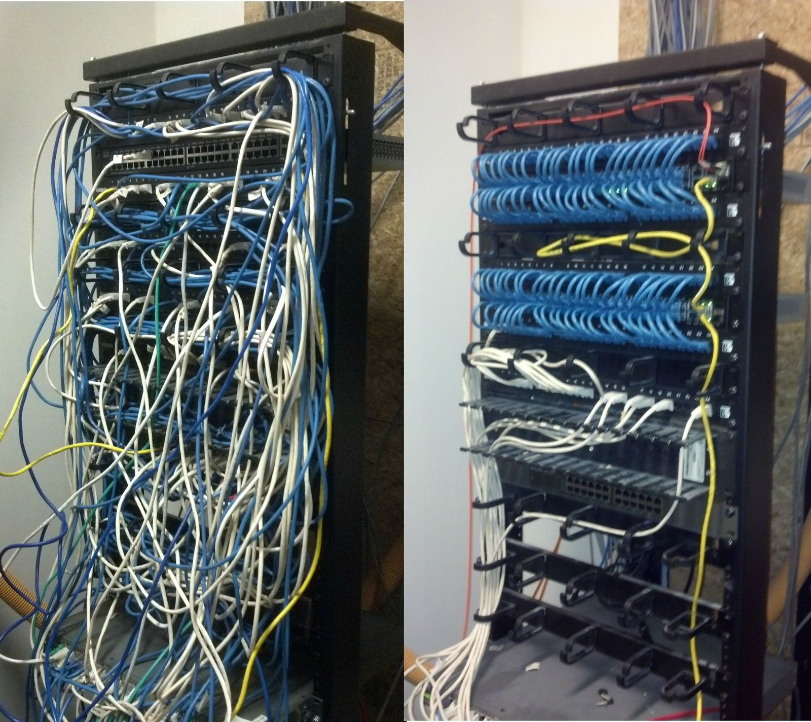

# Компьютерные Сети
Курс лекций читала: Тихомирова Е.А.

Лаборант: Клочков М.Н.

Писали только РК1, экз представлял собой вопросы по лабам за которые лаборант поставил меньше 10 баллов из возможных 12, одна лаба - один вопрос

Год: 2025

Всем удачи)