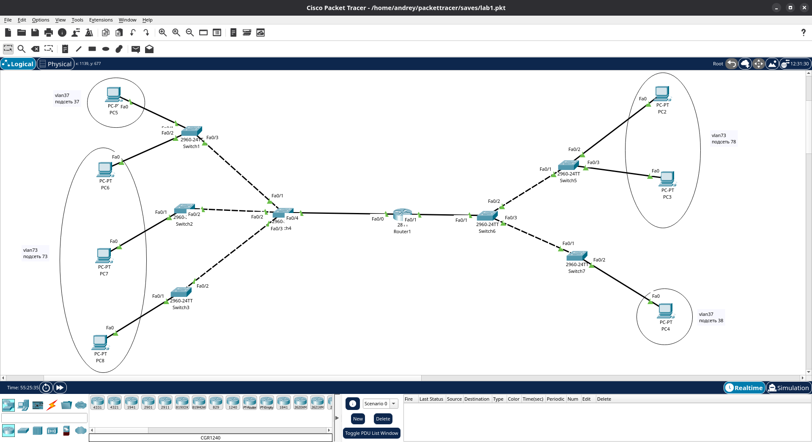
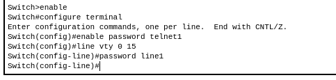
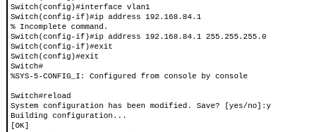
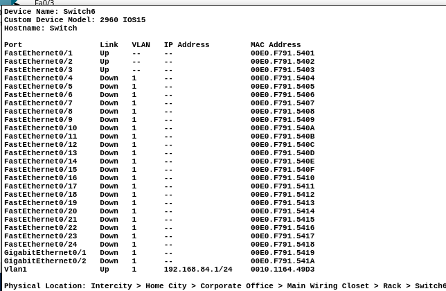
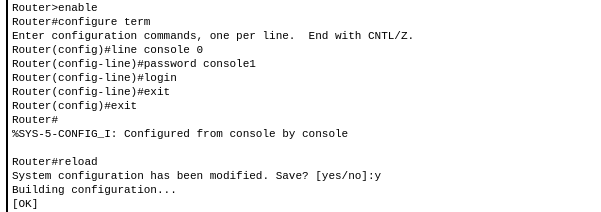
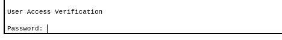
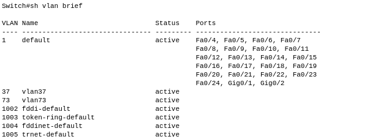
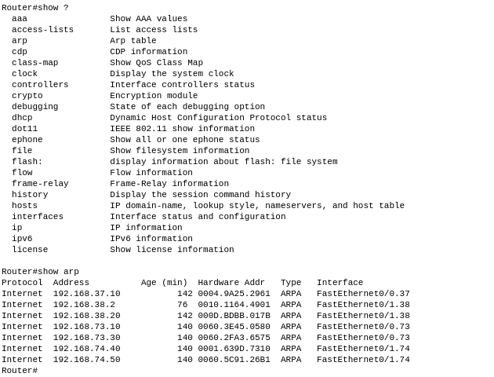
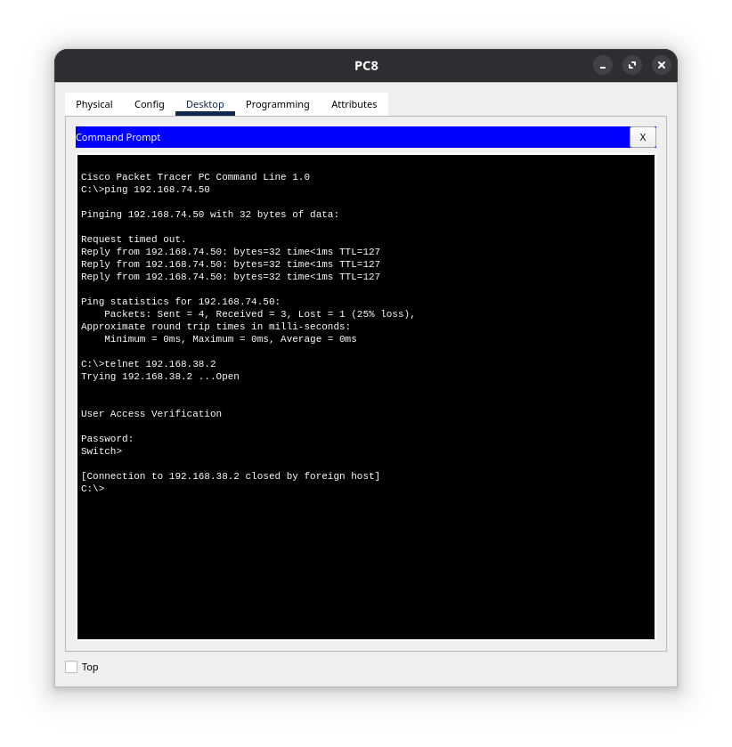

### **Лабораторная №1**

[]()

**1. прописываем ip всех PC с учетом подсетей**

**2. создаем на switch необходимые vlan,
проставляем на switch по FastEthernet0/\* необходимые vlan**

**3. выставляем по FastEthernet0/\* trunk между switch-ми, роутером и switch-ми**

**4. устанавливаем подсети на роутере**
```
Router> enable
Router# configure terminal
```
Включаем физический интерфейс Fa0/0
```
interface FastEthernet0/0
no shutdown
exit
```
Subinterface для VLAN 37 (сеть 192.168.37.0/24)
```
interface FastEthernet0/0.37
encapsulation dot1Q 37
ip address 192.168.37.1 255.255.255.0
exit
```
Subinterface для VLAN 73 (сеть 192.168.73.0/24)
```
interface FastEthernet0/0.73
encapsulation dot1Q 73
ip address 192.168.73.1 255.255.255.0
exit
```

Включаем физический интерфейс Fa0/1
```
interface FastEthernet0/1
no shutdown
exit
```
Subinterface для VLAN 37 (сеть 192.168.38.0/24)
```
interface FastEthernet0/1.38
encapsulation dot1Q 37
ip address 192.168.38.1 255.255.255.0
exit
```
Subinterface для VLAN 73 (сеть 192.168.74.0/24)
```
interface FastEthernet0/1.74
encapsulation dot1Q 73
ip address 192.168.74.1 255.255.255.0
exit
```
Сохраняем конфигурацию
```
exit
Router# reload
```
**5. настройка telnet**

[]()

[]()

[]()

**6. настройка консоли на роутере**

[]()
[]()

### **На самой защите посмотрели**

[]()

[]()

[]()